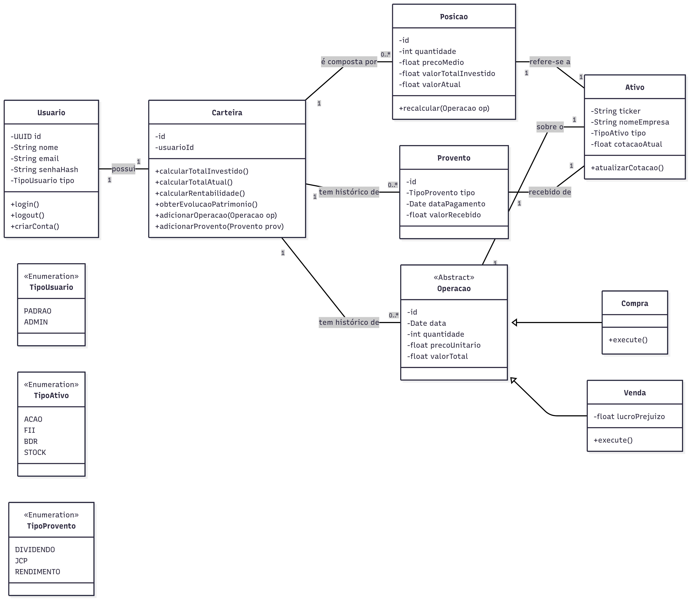

# Arquitetura do Projeto

Bem-vindo à seção de Arquitetura do projeto **Milo Invest**.

O objetivo aqui é fornecer uma visão de alto nível sobre a estrutura técnica da plataforma, as tecnologias utilizadas e as decisões de design que guiam o desenvolvimento.

Seguindo a filosofia de uma documentação ágil, focaremos em diagramas e descrições concisas. Este documento deve servir como um guia rápido para facilitar o onboarding de novos desenvolvedores e alinhar a equipe sobre os padrões adotados.

## Diagrama de Classes

O diagrama acima representa o núcleo do domínio da aplicação, modelando como a carteira de um investidor é estruturada e gerenciada.

A entidade central é a `Carteira`, que pertence a um `Usuario`. A `Carteira` é composta por um conjunto de `Posicao`, que representa a consolidação de um ativo específico na carteira (ex: 100 ações de PETR4 com um certo preço médio). Cada `Posicao` se refere a um `Ativo`, que contém as informações descritivas do papel (ticker, nome da empresa, etc.).

O histórico de transações é modelado através da classe abstrata `Operacao` (com suas especializações `Compra` e `Venda`) e da classe `Provento`. Estes eventos são utilizados para criar e recalcular o estado de cada `Posicao`.

Este modelo permite um registro transacional completo do histórico do usuário, enquanto mantém uma visão consolidada e sempre atualizada da sua carteira.
