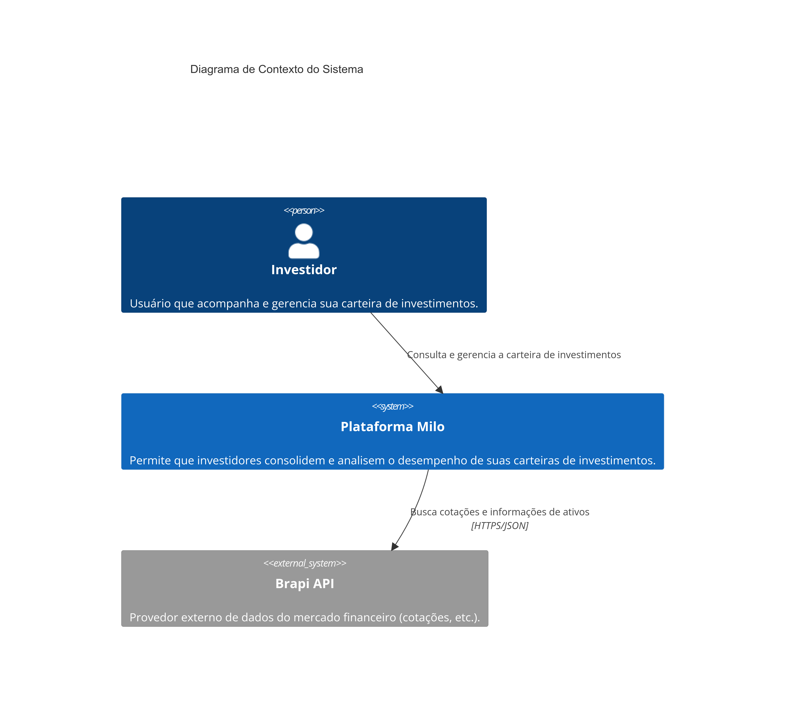
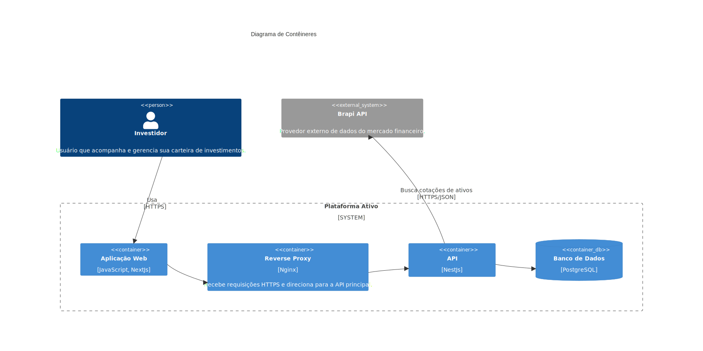

# Arquitetura do Projeto

Bem-vindo à seção de Arquitetura do projeto **Milo Invest**.

O objetivo aqui é fornecer uma visão de alto nível sobre a estrutura técnica da plataforma, as tecnologias utilizadas e as decisões de design que guiam o desenvolvimento.

Seguindo a filosofia de uma documentação ágil, focaremos em diagramas e descrições concisas. Este documento deve servir como um guia rápido para facilitar o onboarding de novos desenvolvedores e alinhar a equipe sobre os padrões adotados.

## Diagrama de Classes

O diagrama acima representa o núcleo do domínio da aplicação, modelando como a carteira de um investidor é estruturada e gerenciada.

A entidade central é a `Carteira`, que pertence a um `Usuario`. A `Carteira` é composta por um conjunto de `Posicao`, que representa a consolidação de um ativo específico na carteira (ex: 100 ações de PETR4 com um certo preço médio). Cada `Posicao` se refere a um `Ativo`, que contém as informações descritivas do papel (ticker, nome da empresa, etc.).

O histórico de transações é modelado através da classe abstrata `Operacao` (com suas especializações `Compra` e `Venda`) e da classe `Provento`. Estes eventos são utilizados para criar e recalcular o estado de cada `Posicao`.

Este modelo permite um registro transacional completo do histórico do usuário, enquanto mantém uma visão consolidada e sempre atualizada da sua carteira.

# Diagramas de Arquitetura (C4 Model)

Para documentar a arquitetura da plataforma **Ativo**, utilizamos uma abordagem baseada no **C4 Model**. Este modelo foi criado para descrever a arquitetura de software em diferentes níveis de abstração (Contexto, Contêineres, Componentes e Código), tornando-a compreensível tanto para equipes técnicas quanto para stakeholders de negócio.

Nesta seção, apresentamos os dois primeiros e mais altos níveis de abstração: o Diagrama de Contexto (Nível 1) e o Diagrama de Contêineres (Nível 2).

## Nível 1: Diagrama de Contexto do Sistema

O Diagrama de Contexto é a visão mais ampla do sistema. Ele mostra como a nossa plataforma se encaixa no mundo, quem são seus usuários e com quais outros sistemas ela interage. Ele não revela tecnologias ou detalhes de implementação.

Nosso sistema, a **Plataforma Ativo**, está no centro. Ele interage com duas entidades principais:

1.  **Investidor (Pessoa):** O usuário final da nossa plataforma. Ele utiliza o sistema para consultar e gerenciar sua carteira de investimentos.
2.  **Brapi API (Sistema Externo):** Um sistema externo que atua como nosso provedor de dados do mercado financeiro. Nossa plataforma consome esta API para buscar cotações e informações atualizadas sobre os ativos.

## Nível 2: Diagrama de Contêineres

O Diagrama de Contêineres aproxima o zoom para dentro dos limites do nosso sistema, mostrando os principais blocos de construção tecnológicos que o compõem. Cada "contêiner" representa uma aplicação ou um repositório de dados que pode ser executado de forma independente (como um serviço de backend, um frontend web ou um banco de dados).

A **Plataforma Ativo** é composta pelos seguintes contêineres:

1.  **Aplicação Web (Frontend):** Construída com **Next.js**, é a interface com a qual o **Investidor** interage. É responsável por toda a experiência do usuário e se comunica com a nossa API principal via HTTPS.

2.  **Reverse Proxy (Nginx):** Atua como a porta de entrada para o nosso sistema. Ele recebe todas as requisições da Aplicação Web, gerencia o tráfego e as direciona para a API, adicionando uma camada de segurança e flexibilidade.

3.  **API (Backend):** O cérebro do nosso sistema, desenvolvido em **NestJS**. Contém toda a lógica de negócio, como gerenciamento de usuários, carteiras e operações. É responsável por persistir os dados no banco e por buscar informações externas na Brapi API.

4.  **Banco de Dados (PostgreSQL):** Nosso contêiner de armazenamento. É um banco de dados relacional **PostgreSQL** que persiste todas as informações dos usuários, suas carteiras, ativos e histórico de operações.
